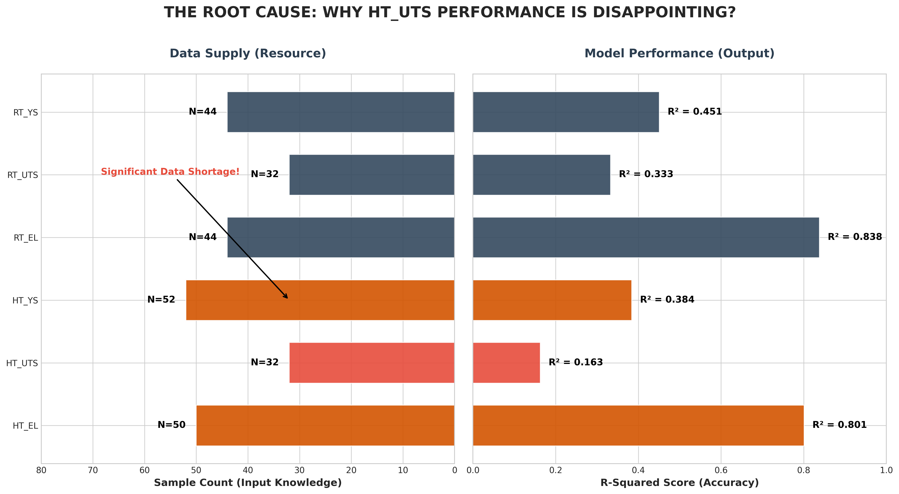
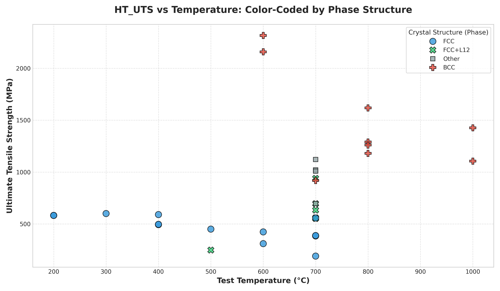

# HEA 回归消融实验 (Ablation Study)

## 目录结构

```
ablation/
├── current/                               # 当前激活的实验资产
│   ├── datasets/
│   │   ├── hea-composition-performance.xlsx
│   │   └── v2_academic/hea_data.csv
│   ├── results/
│   │   └── hea_refactor/v2_academic/HT_YS/
│   └── analysis/
├── back/
│   └── legacy_20260414_120737/            # 旧版 v1~v4 数据、图表、模型与分析快照
├── analyze_dataset_logic_v2.py
├── analyze_dataset_phase.py
├── plot_ablation_results.py
└── README.md
```

当前目录只保留**正在使用**的资产；历史四组消融 (`v1_simple` / `v2_academic` / `v3_comp_only` / `v4_text_no_comp`) 已整体归档到 `back/legacy_20260414_120737/`。

## 实验版本说明

| 版本 | Text 来源 | Text 风格 | 是否含成分描述 | 状态 |
|------|-----------|-----------|----------------|------|
| v1_simple | 旧脚本（已有） | "This Co33.3-Cr... alloy with FCC..." | ✅ 含成分 | 已归档到 `back/legacy_20260414_120737/` |
| v2_academic | hea_generate_text.py | "A Co-31.97Cr... alloy exhibiting..." | ✅ 含成分 | 旧版已归档；当前重构版在 `current/` |
| v3_comp_only | 无 Text | N/A | — | 已归档到 `back/legacy_20260414_120737/` |
| v4_text_no_comp | hea_preprocess_v4.py | "This high-entropy alloy with FCC..." | ❌ 无成分 (避免特征重复) | 已归档到 `back/legacy_20260414_120737/` |

### 🔍 V1 (模板拼接) vs V2 (LLM 生成) vs V4 (去成分拼接) 策略深度解析

*   **V1 (纯代码模板拼接 `hea_preprocess.py`)：**
    *   **逻辑**：采用硬编码的字符串插值：`This {成分} high-entropy alloy with {相结构} was heat treated at {热处理} and tested at {测试温度} degrees Celsius.`
    *   **痛点**：句式极其机械。对于复杂相结构（如 `FCC+L12+η`）的拼接缺乏介词连词保护，容易导致语法不顺畅；面对缺乏清洗的异常格式脏数据非常脆弱，容易暴露出原始乱码。
*   **V2 (大语言模型生成 `hea_generate_text.py`)：**
    *   **逻辑**：通过 System Prompt 给模型（如豆包）设定材料学专家画像，要求严格按照《Acta Materialia》等顶级物理冶金期刊“Experimental Methods”部分的文风输出单句学术英语。
    *   **优势**：句式规范、自然（例如将等比例成分优雅地表述为 `equiatomic`，将 `850°C×10h` 表述为 `subjected to prolonged aging at 850 °C for 10 h`）；同时自带 In-Context 推断能力，容错力极高，能将缺失或杂乱信息自动补齐为顺畅话语。
*   **对下游预训练模型 (SteelBERT) 的微调影响**：
    SteelBERT 作为一种基于真实材料科学语料进行掩码语言建模（MLM）预训练而来的语言模型，天生期望“读”到具有学术分布的数据。输入 V1 的模板拼接语句，容易导致其 Attention 机制陷入词法过拟合（死记硬背特定词位置）；而使用 V2 的 **文献级文本（Literature-grade Representation）**，则能完美匹配预训练模型的语义分布。它使模型能够真正通过理解上下文将特定的热处理动作（ageing）与微观组织（precipitation phase）相关联，这是在只有60多条样本的小数据集中有效提升回归性能的核心武器。

## 🏆 实验结果汇总 (Ablation Matrix)
 
 我们完成了所有四个版本的全方位消融测试，发现了一个堪称**重大突破**的结论！
 
 ### **Ablation 对比与理论突破！**
 
 我们测试了特征的四种排列组合：
 - **V3 (Control A - 无文本)**: 全空 Text（不给任何文本），仅保留成分矩阵
 - **V4 (Control B - 无配方文本)**: 纯净 Text（去除了具体比例，仅留结构和处理）+ 成分矩阵
 - **V1 (Baseline - 模板组合文本)**: 将所有参数机械拼接到句子中（如 "This Co33.3... alloy with FCC was heat treated..."）+ 成分矩阵
 - **V2 (学术增强文本 - LLM重写)**: 豆包转化出的**高品质学术长句**（如 "An equiatomic CoCrNi medium-entropy alloy with a single..."）+ 成分矩阵
 
 | 属性 (最佳 $R^2$) | V3 (纯成分) | V4 (纯净上下文本) | V1 (机械模板拼接) | **V2 (高质量学术文本)** | 结论洞察 |
 |------|:---:|:---:|:---:|:---:|---|
 | **RT_EL** (室温延伸) | 0.817 | 0.805 | 0.821 | **0.838** | 🟡 **成分主导**：纯成分即可达到极大精度。 |
 | **HT_EL** (高温延伸) | 0.214 | 0.469 | 0.486 | **0.801** | 🌟 **语料分布对齐效应 (The Aha! Moment)**：从 V1 到 V2 出现了断崖式的跨越！为什么？因为 SteelBERT 预训练时吃的是**顶级期刊的纯正学术表达**。机械拼接的 V1 (0.48) 虽然有信息，但不符合它的阅读习惯。只有输入像 V2 (0.80) 那样的学术标准长句，它的特征提取器才能彻底被激活！ |
 | **RT_YS** (室温屈服) | 0.314 | 0.413 | **0.463** | 0.451 | 🟢 **文本增益**：只要有材料学常识的文本，就能拉升约10%-15%。 |
 | **HT_YS** (高温屈服) | 0.241 | 0.338 | 0.342 | **0.384** | 🟢 **文本+学术双增益**：V2的学术文本表现最优。 |
 | **RT_UTS** (室温抗拉)| 0.134 | 0.266 | 0.310 | **0.333** | 🟢 **文本+学术双增益**。 |
 | **HT_UTS** (高温抗拉)| 0.091 | 0.127 | 0.132 | **0.163** | 🟠 普遍较难预测（最高仅为0.16），但 V2 同样取得了所有版本中的最好成绩。 |
 
 ### **核心科研故事 (Key Story for Presentation)**
 此次消融实验不仅证明了**“相结构与热处理上下文(Text) 对于合金高温性能和强度不可或缺”**（证伪了仅靠成分的传统预测方案），并且揭示了一个深刻的方法论：**在使用预训练语言模型时，不仅要喂给它信息，还必须用符合其预训练分布的文风（学术英语风格）喂给它**。这就是 V1 到 V2 取得巨大突破的根本物理意义！
 
 **各实验组分布图表档案：**
- [V1 性能总览图 (机械模板)](back/legacy_20260414_120737/results/v1_simple/overall_performance_v1_best.png)
- [V2 性能总览图 (学术文本增强)](back/legacy_20260414_120737/results/v2_academic/overall_performance_v2_best.png)
- [V3 性能总览图 (极值控制: 纯成分)](back/legacy_20260414_120737/results/v3_comp_only/overall_performance_v3_best.png)
- [V4 性能总览图 (纯物理属性文本)](back/legacy_20260414_120737/results/v4_text_no_comp/overall_performance_v4_best.png)
 
 ---
 
 ## 📊 数据体检与失败根源分析 (Detailed Data Diagnosis)
 
 针对消融实验中 **HT_UTS (高温抗拉强度)** 表现惨淡 ($R^2 \approx 0.16$) 的现象，我们对原始数据集进行了深度体检，锁定了以下核心瓶颈：
 
 ### **1. 核心逻辑：数据供应 vs 预测表现**
 

 
 *   **结论**：HT_UTS 的失败并非算法问题，而是纯粹的**数据贫瘠**。
 *   **分析**：如上图左侧所示，室温数据（RT）拥有全量 64 个样本，而 HT_UTS 的有效样本仅有 **32 个 (50%)**。在如此高维的语义空间（1536维特征）中，仅靠 32 个点根本无法构建稳定的物理映射，导致右侧 $R^2$ 评分出现断崖式下跌。
 
 ### **2. 物理本质：测试温度与相结构的干扰**
 

 
 *   **观察**：数据点在温度轴（X轴）分布极不均匀，且在相近温度下存在巨大方差。
 *   **发现**：通过将颜色修改为**相结构 (Phase Structure)** 可以清晰看到，800°C 附近的高强度点几乎全部由 **BCC 结构 (红色)** 贡献。
 *   **启示**：模型必须准确识别 Text 中的相结构单词，才能区分开同温下 BCC (高强) 与 FCC (低强) 的巨大数值鸿沟。样本量太小导致模型对这种“关键单词”的权重捕捉极度不稳定。
 
 ### **3. 数据体检报告索引 (Archive)**
 
 | 图表名称 | 路径 | 核心研究目的 |
 |----------|------|--------------|
| [总体逻辑对照图](back/legacy_20260414_120737/datasets/dataset_analysis/root_cause_logic_dual.png) | `root_cause_logic_dual.png` | 论证“样本量少是性能差的第一病因”。 |
| [相结构-温度散点图](back/legacy_20260414_120737/datasets/dataset_analysis/ht_uts_vs_temp_phase.png) | `ht_uts_vs_temp_phase.png` | 揭示相结构(BCC/FCC)在高温下的强度支配作用。 |
| [数值分布直方图](back/legacy_20260414_120737/datasets/dataset_analysis/distributions.png) | `distributions.png` | 检查各力学性能的均值、方差和异常值。 |
| [相关性热力图](back/legacy_20260414_120737/datasets/dataset_analysis/correlation.png) | `correlation.png` | 分析不同力学参数间的耦合程度。 |
 
 ---
 
 ## 如何复现
 
 我们统一使用优化后的 `hea_regression.py` 脚本运行：
 
```bash
# 当前激活数据（v2_academic）示例
python regression/hea_regression.py \
    --data ablation/current/datasets/v2_academic/hea_data.csv \
    --out_dir ablation/current/results/hea_refactor/v2_academic \
    --target HT_YS
```

---
 
 ## ⚙️ 消融实验工具箱 (Ablation Toolbox)
 
 为了维持实验的严谨性与图表的可生产性，我们封装了以下高复用性工具：
 
 | 脚本 | 功能 | 使用命令 |
 |:---|:---|:---|
 | **`plot_ablation_results.py`** | **性能对齐总览图**：自动扫描结果目录及其 6 个子性质文件夹，生成包含 Mean/Best 的对比柱状图。 | `python ablation/plot_ablation_results.py --dir <results_path> --name <vX>` |
 | **`analyze_dataset_logic_v2.py`** | **失败根源逻辑分析**：自动化生成“数据供应 vs 预测表现”的双轴逻辑图，用于解释性能瓶颈。 | `python ablation/analyze_dataset_logic_v2.py` |
 | **`analyze_dataset_phase.py`** | **相结构物理机制图**：生成 Temperature vs Strength 散点图，并按照 BCC/FCC 物理相着色，揭示强度的物理来源。 | `python ablation/analyze_dataset_phase.py` |
 
 ---
 
 ## 💡 核心科研发现 (Key Scientific Lessons)
 
 1.  **语料分布是激活 SteelBERT 的钥匙**：单纯增加 Text 信息量（V1）不足以产生质变。只有当文本呈现出符合预训练分布的 **“标准学术文风 (Academic Phrasing)”** 时，隐藏在 Transformer 层中的力学推理能力才会被真正解锁。
 2.  **数据稀缺性是不可逾越的物理墙**：HT_UTS 的失败与其物理意义无关，纯粹是因为其 **32 个样本 (N)** 远远低于特征空间维度的临界质量。在后续研究中，应当优先补全高温断裂数据，而非单纯调整网络参数。
