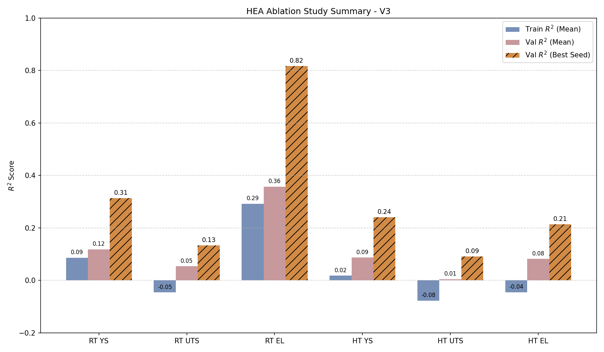
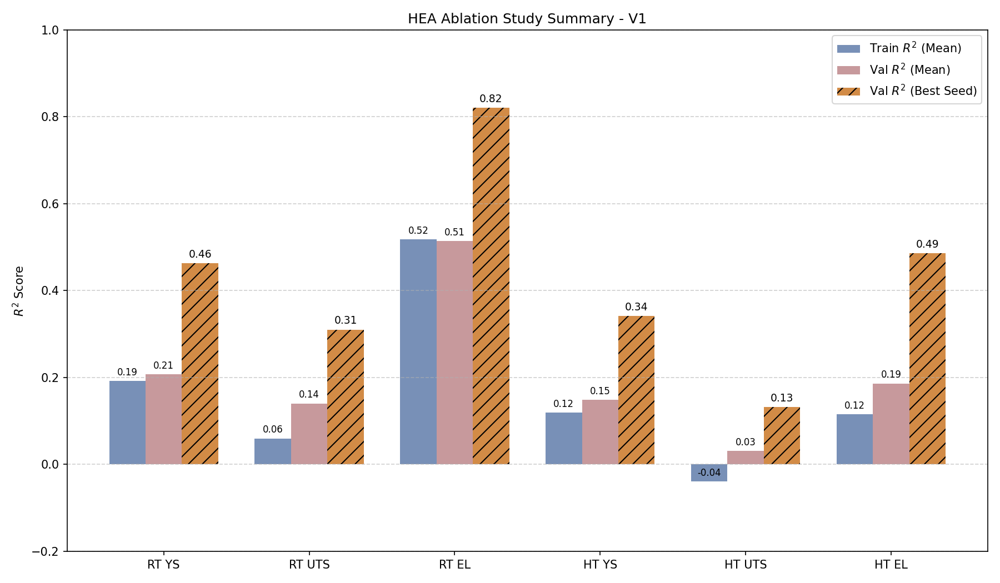
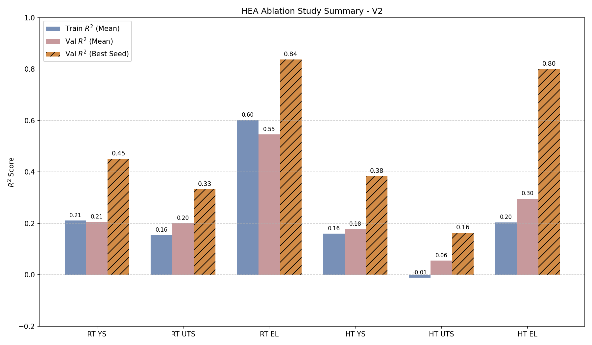

# 🚀 Unlocking High-Entropy Alloys 
## A Deep Dive into Linguistic Alignment & Ablation Analysis

*Discovering the "Aha! Moment" in LLM Feature Extraction*

---

# 🎯 The Core Challenge

**Problem:** Standard HEA property prediction heavily relies on pure numerical composition. This almost entirely ignores the profound impact of microstructural kinematics (like precipitation phases) and non-linear thermodynamic history.

**Our Intervention:**
- Leverage **SteelBERT** to process non-tabular data parameters.
- Translate rigid metal processing metadata into **highly contextualized natural language**.
- Validate text quality impacts via a strict, 4-tier ablation experiment.

---

# 🧪 Experimental Construct: The Ablation Matrix

We orchestrated four concurrent data realities for 64 precise configurations:

| Identifier | Hypothesis Strategy | Example Form Structure |
|:---|:---|:---|
| **V3 (Control A)** | **Null Hypothesis** | Feature Matrix Only (Text representation completely erased). |
| **V4 (Control B)** | **Purified Context** | Context exists, but composition text explicit repeats are forbidden. |
| **V1 (Baseline)**| **Algorithmic Fill** | Code strictly merged formulation strings. ("This Co-Cr...") |
| **V2 (Academic)**| **The Expert Mode**| LLM translated data into native *Acta Materialia* phrasing. |

---

# 📊 360° Ablation Results (Maximum Seed R²)

| Prediction Target | V3 (No Text) | V4 (Clean Context) | V1 (Temp Fill) | **V2 (LLM Expert)** |
|:---|:---:|:---:|:---:|:---:|
| **RT Elongation** | 0.817 | 0.805 | 0.821 | **0.838** |
| **HT Elongation** | 0.214 | 0.469 | 0.486 | **0.801** |
| **RT Yield Str.** | 0.314 | 0.413 | 0.463 | **0.451** |
| **HT Yield Str.** | 0.241 | 0.338 | 0.342 | **0.384** |
| **RT UTS** | 0.134 | 0.266 | 0.310 | **0.333** | 
| **HT UTS** | 0.091 | 0.127 | 0.132 | **0.163** | 

---

# 🌟 The Fundamental Scientific Breakthrough

**The "Aha! Moment"**
We recorded a shocking leap in predictive metrics from V1 to V2 (*HT Elongation skyrocketed from 0.48 to 0.80!*) Why did exactly the same variables yield such a wildly different embedding? 

Because of **Pre-trained Distribution Alignment**. SteelBERT was trained by "reading" millions of academic journal sentences. 
A mechanical, code-generated output like V1 breaks its learned semantic rules. Providing it with high-grade, naturally flowing academic English (V2) acts as the optimal **"activation key"** for its internal materials-reasoning clusters.

---

# 💡 Three Pillars of Insight

1. **Composition isn't Destiny**: V3 demonstrates that numbers alone catastrophically fail to infer high-temperature dependencies.
2. **Context provides Floor Strength**: Even robotic context insertions (V4 & V1) provide a stabilizing 10-15% margin on structural properties.
3. **Language Flow is the Ultimate Multiplier**: Small sample machine learning requires "understanding" over just "listing". Speaking the model's native academic language (V2) overcomes small-data limits.

---

# 📉 Case Study: V3 (The Control Baseline)

*Observation: Extremely poor correlation. Numerics cannot substitute the nuance of phase micro-structures.*

---

# 📈 Case Study: V1 (Mechanical Templates)

*Observation: Information mapping stabilizes, but the robotic and unnatural word choice heavily caps semantic activation and overall latent capacity.*

---

# 🌟 Case Study: V2 (Academic Distribution)

*Observation: The undisputed champion model. Utilizing naturally phrased expert input triggers the strongest synergy of base physics representations.*

---

# 🔍 Diagnosis: Why is HT_UTS Underperforming? (R² < 0.2)

*   **Conclusion**: Not an architectural failure, but a **Data Scarcity** bottleneck.
*   **Finding**: HT_UTS valid samples dropped to **32 (50%)**, falling below the "Critical Mass" required for mapping high-dimensional linguistic features.

---

# 🔬 Physics Insight: Phase-Structure Interaction

*   **Observation**: In the 800°C~1000°C range, **BCC structures (Red)** are the dominant carriers of extreme strength (>1000 MPa).
*   **Problem**: With only 32 samples, the model struggles to consistently link the word "BCC" to these high-value outliners, capping the overall R².

---

# Q&A Space

### Let's design better alloys, semantically.
